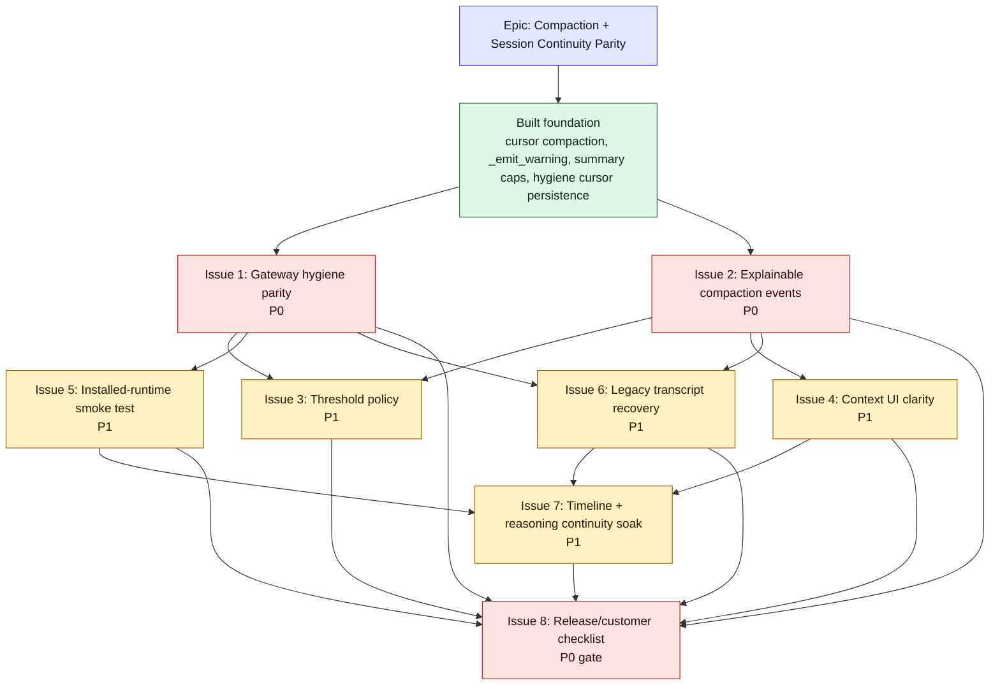

# EPIC - Compaction and session continuity parity

Date: 2026-06-17
Repo: `/Users/dartagnanpatricio/elevate`
Status: active local epic; foundation and Issues 1-2 are partially implemented;
Issues 3-4 now have detailed build plans

> **Outcome:** Telegram, desktop chat, and resumed sessions behave like one
> product: no surprise repeat compactions, no blank or stalled timelines, no
> hidden reasoning gaps, and no support-only mystery when context is compacted.
>
> **Principle:** `AIAgent` owns model-facing compaction. Adapters such as
> Telegram/gateway and desktop may recover legacy state, but they should not
> run a separate normal compaction policy.

## Why this epic exists

The customer-visible failure was a Telegram session that kept hitting
compression on a huge old transcript, then crashed with:

```text
'AIAgent' object has no attribute '_emit_warning'
```

That error was only the visible symptom. The broader issue is that session
continuity now has several layers that can all affect user experience:

- `AIAgent` + `ContextCompressor` use cursor compaction: append-only transcript,
  persisted `compaction_cursor` and `compaction_summary`, API payload becomes
  summary plus tail.
- Desktop chat mostly reaches the normal `AIAgent` session path directly.
- Telegram goes through gateway session hygiene first because it owns platform
  delivery, chat/topic mapping, restart recovery, legacy JSONL/SQLite loading,
  and oversized transcript recovery.
- The UI context ring reports "context left", while internal triggers are based
  on "context used", prune-only stages, full compaction thresholds, critical
  thresholds, and gateway hygiene message-count fallback.

That mix makes compaction look random to users, especially when they see
compaction around 49 percent or 29 percent context remaining.

## What is already built

Recent commits in the current stack:

```text
9f5abb026 fix(desktop): retry failed dashboard loads
38b549190 fix(web): fail fast on stale gateway sockets
df0848c57 fix(diagnostics): record content-free session timeline events
c4cd145f6 fix(compaction): harden cursor compaction and manual compact UX
4ee6f8b5d fix(gateway): persist hygiene compaction cursor
912ff3eb8 fix(agent): cap oversized compaction summaries
7d2cc6a5d fix(gateway): harden compression warning hygiene
92f46310f fix(chat): harden session continuity and compaction
```

Verified fixes already in source and patched into the installed desktop app:

- `AIAgent._emit_warning(...)` exists, so compression warning paths do not crash
  with `AttributeError`.
- Effective pressure checks can estimate the cursor-trimmed payload instead of
  the full append-only transcript.
- Manual `/compact` treats cursor advancement as successful even when the raw
  message list length does not shrink.
- Oversized summary requests are capped against the summary model budget before
  calling the provider.
- Gateway hygiene passes `session_db` into its temporary agent so cursor
  compaction persists instead of advancing only in memory.
- Gateway hygiene now treats the `0.85` line as diagnostic and only performs
  pre-agent recovery for critical overflow or raw legacy message floods.
- Content-free timeline events such as `thinking.delta`, `reasoning.available`,
  and `message.complete` are recorded in the local session event recorder.
- The web gateway client now rejects stale non-open sockets before sending,
  instead of letting submit hang on a dead WebSocket.
- The desktop Electron shell retries failed dashboard navigation after backend
  readiness, which covers the black-shell startup race that manual reload fixed.
- Installed app was patched under
  `/Users/dartagnanpatricio/Applications/Elevate.app/Contents/Resources/cli/`
  for touched CLI/web files, and `app.asar` was patched for the Electron shell.

Verified checks from this stabilization pass:

```text
40 passed - agent compression cursor, scale, hygiene no-op, hygiene, emit warning
54 passed - cursor/status focused suite
99 passed - context compressor suite
38 passed - gateway hygiene, hygiene no-op, compression cursor after session_db fix
py_compile passed - changed source and installed bundle files
installed gateway smoke ok - 140-message Telegram-style transcript compacted to cursor 22, transcript append-only
installed desktop smoke ok - dashboard rendered in the packaged app and a real
  chat response streamed/completed
```

## Epic acceptance

- Reopening a compacted session with `compaction_cursor > 0` does not immediately
  compact again unless the effective summary-plus-tail payload is actually over
  threshold.
- Telegram and desktop chat use the same model-facing compaction semantics.
- Gateway hygiene is limited to legacy recovery and transport-specific safety,
  not a competing normal compaction policy.
- Every compaction event can be explained from logs: trigger, source,
  measured/estimated tokens, threshold, cursor before/after, raw message count,
  effective message count, and whether it was prune, full compact, critical
  compact, manual compact, or legacy hygiene.
- The context UI stops implying random behavior. It distinguishes pending usage,
  context used vs left, and compaction reason.
- A Skyleigh-style flow no longer shows "compacted, resumed, immediately
  compacted again" from stale full-transcript measurement.

## Non-goals

- Do not build a new compaction engine.
- Do not rewrite or delete transcript history as the normal path.
- Do not change memory behavior in this patch set.
- Do not add a DB schema change unless a later issue proves it is required.
- Do not make Telegram and desktop share transport code; make them share the
  session and compaction contract.

## Claude-style UX direction

Product decision: automatic compaction should feel like background maintenance,
not a visible conversation event.

Claude Code's public model is the right comparison point: auto-compact is on by
default, users can run `/compact` manually, and the UI exposes context usage.
The inferred product lesson for Elevate is:

- Auto-compaction should not create a transcript row.
- Auto-compaction should not show a dramatic "Finished compacting" moment.
- Auto-compaction should not make Telegram send a user-facing compression note.
- Soft prune around ~72 percent used is silent maintenance: cheap cleanup, no
  summary LLM, no transcript row, no "compacting" status. If it happens during
  an active turn, the UI can continue showing generic Thinking/Working.
- Full automatic summary compaction may show a neutral working/pending state
  while it blocks the turn, and may close with a small end-of-cycle signal. The
  visible copy should not make compaction the star of the conversation.
- Manual `/compact` stays explicit because the user asked for it.
- Logs and support/debug output must still explain every auto-compaction.
- The context indicator should recover from pending state using fresh provider
  usage, not stale pre-compaction percentages.

In short: the user experience is quiet continuity; the support experience is
full explainability.

## Rollout plan: Hermes behavior, Elevate UX

The goal is not to copy Hermes line-for-line. Hermes can feel fine because the
base platform has fewer surfaces around compaction. Elevate needs the same
model-facing reliability with calmer desktop/Telegram UX.

Order of work:

1. **Stop duplicate ownership first.**
   Build Issue 1 before UI polish. Gateway hygiene should stop acting like a
   second normal compaction engine. It should only handle legacy raw sessions
   and critical overflow protection.

2. **Make auto-compaction explainable to support, quiet to users.**
   Build Issue 2 with logs/status metadata, but keep visible auto-compaction
   copy minimal. Manual `/compact` remains explicit.

3. **Keep soft prune invisible.**
   Soft prune around ~72 percent used is only useful if it prevents expensive
   summary compaction. It should look like normal Thinking/Working during an
   active turn and produce no user-facing "compacting" event.

4. **Let full automatic summary compaction show only if it blocks.**
   If summary compaction takes long enough that the user would think the app is
   frozen, show a neutral working/pending signal. A small end-of-cycle signal is
   acceptable; a transcript row or dramatic completion state is not.

5. **Measure whether soft prune should stay.**
   After Issues 1-2, log how often prune-only avoids a later full compaction. If
   it does not materially reduce full compactions or errors, remove/disable its
   user-facing path entirely and consider disabling the prune stage.

6. **Only then tune thresholds.**
   Threshold defaults, pinned `0.85`, and stale `0.50` copy belong to Issue 3.
   Do not mix threshold policy into Issue 1 or Issue 2.

Smallest implementation target:

```text
Issue 1:
  Gateway no longer pre-agent compacts for ordinary 85% token pressure.
  Gateway still recovers legacy raw sessions and critical 95% pressure.

Issue 2:
  Logs explain every decision.
  Soft prune has no visible compaction UI.
  Full auto-summary compaction shows neutral pending only if blocking.
  Manual /compact remains explicit.

Issue 4:
  Context ring/pending state becomes Claude-style calm continuity.
```

## Dependency graph



## Planning approach

Do not create eight detailed build plans at once. That would turn into stale
planning debt as soon as Issues 1 and 2 change the shape of the system.

Use this planning model instead:

1. Keep this epic as the parent truth: outcome, acceptance, dependencies, and
   release gates.
2. Create detailed implementation plans only for the next P0s:
   - Issue 1: gateway hygiene parity
   - Issue 2: explainable compaction events
3. Promote Issues 3-4 now that the foundation has source commits and installed
   desktop smoke coverage.
4. Promote each stub to a real plan only when it is about to be built.

Plan file convention:

```text
cli/docs/plans/compaction-issue-01-gateway-hygiene-parity.md
cli/docs/plans/compaction-issue-02-explainable-events.md
cli/docs/plans/compaction-issue-03-threshold-policy.md
cli/docs/plans/compaction-issue-04-context-ui-clarity.md
cli/docs/plans/compaction-issue-05-installed-runtime-smoke.md
cli/docs/plans/compaction-issue-06-legacy-transcript-recovery.md
cli/docs/plans/compaction-issue-07-timeline-reasoning-soak.md
cli/docs/plans/compaction-issue-08-release-checklist.md
```

Detailed plans currently created:

- `cli/docs/plans/compaction-issue-01-gateway-hygiene-parity.md`
- `cli/docs/plans/compaction-issue-02-explainable-events.md`
- `cli/docs/plans/compaction-issue-03-threshold-policy.md`
- `cli/docs/plans/compaction-issue-04-context-ui-clarity.md`

Execution tracker:

| Issue | Status | Plan doc | Promote when |
| --- | --- | --- | --- |
| 1. Gateway hygiene parity | partially implemented; needs Telegram-style installed soak | yes | close after legacy/critical recovery smoke |
| 2. Explainable compaction events | partially implemented; recorder/logs improved, support summary still open | yes | close after one-event explanation coverage |
| 3. Threshold policy | detailed plan ready | yes | build next |
| 4. Claude-style context UI clarity | detailed plan ready | yes | build after Issue 3 or alongside if diff stays small |
| 5. Installed-runtime smoke | stub only | no | Issue 1 behavior is stable |
| 6. Legacy transcript recovery | stub only | no | Issue 1 separates legacy vs normal |
| 7. Timeline/reasoning soak | stub only | no | Issues 4-6 have checks |
| 8. Release checklist | stub only | no | release candidate exists |

Next action rule:

1. Build Issue 3 so the product has one threshold ladder instead of stale
   `0.85`/`0.90`/`0.95` explanations scattered across code and copy.
2. Build Issue 4 so the context ring/status UI matches the policy and stays
   quiet during automatic maintenance.
3. Then turn Issue 5 and Issue 6 into detailed plans for installed-runtime
   smoke and legacy transcript recovery.

Deep-dive branching model:

Do not try to finish this epic in one branch. Use one committed docs baseline,
then local worktrees for deep sections:

```text
main
  docs: epic + plans committed

../elevate-compaction-issue-01
  branch: deep/compaction-issue-01-gateway-hygiene
  purpose: gateway ownership, legacy recovery, parity tests

../elevate-compaction-issue-02
  branch: deep/compaction-issue-02-events
  purpose: logs/events/status clarity, no behavior change unless needed
```

Suggested commands after the docs are committed:

```bash
git worktree add ../elevate-compaction-issue-01 -b deep/compaction-issue-01-gateway-hygiene main
git worktree add ../elevate-compaction-issue-02 -b deep/compaction-issue-02-events main
```

Operating rules:

1. Issue 1 is allowed to change behavior.
2. Issue 2 should be observability-first; behavior changes only if Issue 1
   proves they are required.
3. If Issue 2 needs code from Issue 1, rebase it onto Issue 1 after Issue 1
   lands locally.
4. Do not open worktrees for Issues 3-8 until their dependency is real.

Read-only subagent pass, 2026-06-17:

- Issue 1 audit confirmed the plan: gateway hygiene is still a competing
  ordinary compaction policy at its own `0.85` line. The first behavior change
  should narrow gateway pre-agent compaction to legacy recovery and critical
  overflow protection.
- Issue 1 audit found the main pre-code unknown: positive
  `session_entry.last_prompt_tokens` may be stale/full-transcript after resume
  and currently wins over effective cursor estimates.
- Issue 2 audit confirmed the minimal instrumentation path: use existing logs,
  shared `compress_context`, and `status.update`; do not add a telemetry
  framework or frontend state machine.
- Threshold audit confirmed default/pinned threshold cleanup waits for Issue 3.
  Do not change config defaults, migration behavior, or 0.50/0.85 stale copy in
  Issues 1-2.
- Installed-runtime audit confirmed source tests are not enough. Every patch
  must verify the live plist/runtime points at
  `/Users/dartagnanpatricio/Applications/Elevate.app/Contents/Resources/cli`,
  then patch and test the installed bundle.

Detailed plan contract:

```text
# Issue N - Name

## Problem
## Current behavior
## Desired behavior
## Files / seams
## Implementation steps
## Tests
## Installed app verification
## Acceptance criteria
## Risks / rollback
```

---

# ISSUE 1 - Make gateway hygiene a thin legacy recovery wrapper

**Goal:** Normal Telegram compaction decisions come from the same effective
payload policy as desktop chat.

**Files:** `cli/gateway/run.py`, `cli/run_agent.py`,
`cli/agent/conversation_compression.py`

**Size:** M-L - **Priority:** P0 - **Depends on:** current cursor fixes

- **1.1** Audit every gateway hygiene entry point that can run before an
  `AIAgent` turn.
- **1.2** Split triggers into two named classes:
  - normal pressure trigger: delegated to `AIAgent`/shared pressure helpers
  - legacy recovery trigger: raw transcript or imported session safety valve
- **1.3** Keep `_HARD_MSG_LIMIT = 400` only as a legacy recovery guard for raw,
  uncompacted transcripts. Do not let it repeatedly summarize an already
  cursor-compacted session from scratch.
- **1.4** Add tests where a large raw transcript with existing cursor metadata
  does not trigger hygiene again before the agent sees the turn.
- **1.5** Add tests where a truly uncompacted legacy transcript still gets
  recovered safely.

**Acceptance:** A Telegram session with cursor metadata reaches the normal agent
turn with the same effective payload shape as desktop: system plus summary plus
tail.

# ISSUE 2 - Make compaction events explainable in product terms

**Goal:** Support logs can tell why compaction happened without making automatic
compaction feel like a visible chat event.

**Files:** `cli/run_agent.py`, `cli/agent/context_compressor.py`,
`cli/agent/conversation_compression.py`, `cli/gateway/run.py`,
`cli/tui_gateway/server.py`

**Size:** M - **Priority:** P0 - **Depends on:** Issue 1 can run in parallel

- **2.1** Standardize a small internal reason enum: `prune`, `full_compact`,
  `critical_compact`, `manual_compact`, `legacy_hygiene`.
- **2.2** Log pressure source: provider usage, real-count projection, effective
  estimate, or raw message count fallback.
- **2.3** Log raw vs effective messages, prompt tokens, window size, threshold,
  cursor before/after, and summary token estimate.
- **2.4** Ensure manual `/compact` reports cursor compaction honestly, for
  example "Compacted earlier turns: 66 more messages summarized."
- **2.5** Keep auto-compaction user-visible copy quiet; reserve explicit
  "compacted" completion copy for manual `/compact` or exceptional recovery.
- **2.6** Add a focused support/debug view or command output that can summarize
  the last compaction reason without reading raw logs.

**Acceptance:** Given any future "why did it compact here?" report, we can
answer from one event record instead of reconstructing from multiple layers.

# ISSUE 3 - Decide and enforce the threshold policy

**Goal:** Stop the appearance of random compaction by using one documented
threshold ladder.

**Files:** config/defaults, `cli/agent/context_compressor.py`,
`cli/agent/conversation_compression.py`, `cli/run_agent.py`

**Size:** S-M - **Priority:** P1 - **Depends on:** Issue 2 preferred

Current observed policy:

- Active config pins `compression.threshold: 0.85`.
- Real-count default can allow normal full compaction around 90 percent if the
  config is not pinned lower.
- Critical force path is 95 percent.
- Prune-only can happen earlier, around 72 percent used, which looks like
  "29 percent context left" in the current UI.
- Summary/model reserve is part of the reason normal compaction should not wait
  until 95 percent.

Recommended policy:

- Prune stale heavy tool results before full compaction when savings are clear.
- Normal full compaction at 90 percent effective context used.
- Critical forced compaction at 95 percent.
- Gateway raw-message hygiene only for legacy recovery, not normal sessions.

Subtasks:

- **3.1** Decide whether to remove the pinned 0.85 config or bump it to 0.90.
- **3.2** Document why 95 percent is emergency-only: provider variance, output
  reserve, summarizer reserve, and failed-call risk.
- **3.3** Add tests for each threshold stage using effective payload estimates.
- **3.4** Ensure visible UI wording matches the stage: pruning is not the same
  thing as full compaction.

**Acceptance:** Normal sessions do not full-compact at 49 percent or 29 percent
context remaining unless logs show the UI was reporting "left", prune-only, or
legacy recovery.

# ISSUE 4 - Claude-style context UI clarity

**Goal:** The context UI should make automatic compaction feel calm and normal.

**Files:** `cli/web/src/pages/ChatPage.tsx`, `cli/tui_gateway/server.py`,
`cli/elevate_cli/web_dist/` after rebuild

**Size:** M - **Priority:** P1 - **Depends on:** Issue 2 event fields

- **4.1** Clear the context ring to pending when compaction starts.
- **4.2** Repopulate only from the next real `session.usage` or
  `message.complete` usage payload.
- **4.3** Show whether the percentage is used or left. Pick one product-wide
  convention and make labels/tooltips match it.
- **4.4** Do not render automatic compaction as a transcript/activity event.
  Keep detailed reason/source in logs and support/debug output.
- **4.5** Keep soft prune invisible. It is not user-facing compaction.
- **4.6** Add frontend tests for pending-after-compaction and no fabricated
  "Finished compacting" unless the compact callback actually completed.

**Acceptance:** After auto-compaction, the ring does not keep displaying stale
pre-compaction usage, the timeline keeps moving, and users do not see a
dramatic compaction event unless they ran `/compact` manually or a recovery
failure needs action.

# ISSUE 5 - Add an installed-runtime compaction smoke test

**Goal:** Keep catching the bugs that only show up in the real packaged app.

**Files:** `cli/tests/...` or `scripts/...`, installed app patch workflow docs

**Size:** M - **Priority:** P1 - **Depends on:** current smoke script can be
converted

- **5.1** Convert the successful installed gateway smoke into a repeatable test
  or documented script.
- **5.2** Fixture: Telegram-style oversized raw transcript, temporary
  `ELEVATE_HOME`, gateway hygiene enabled, provider stubbed.
- **5.3** Assert raw transcript remains append-only.
- **5.4** Assert cursor persists before the normal agent turn.
- **5.5** Assert no repeat compaction on the next resumed turn when effective
  payload is below threshold.

**Acceptance:** The smoke reproduces the old failure mode and passes against the
installed bundle after patching.

# ISSUE 6 - Legacy transcript migration and recovery strategy

**Goal:** Old 1,000+ message sessions should recover once, then behave normally.

**Files:** `cli/gateway/run.py`, session loading paths, migration docs

**Size:** M-L - **Priority:** P1 - **Depends on:** Issues 1 and 2

- **6.1** Identify all sources of large raw history: Telegram JSONL, SQLite
  transcript, resumed desktop sessions, and legacy rotated chains.
- **6.2** Mark recovery-mode compaction separately from normal compaction.
- **6.3** Persist cursor/summary from recovery before the agent begins its
  normal turn.
- **6.4** Add a guard that prevents retrying the same failed recovery input on
  every incoming Telegram message.
- **6.5** Define a support-safe fallback for sessions too large to summarize in
  one request: chunked summary or operator-visible reset recommendation.

**Acceptance:** A huge legacy Telegram session either recovers once into
cursor state or reports a clean, actionable recovery failure. It must not crash
or keep retrying the same oversized summary request.

# ISSUE 7 - Real-time timeline and reasoning continuity soak

**Goal:** Compaction should not make messages, thinking, or final responses feel
stalled or out of order.

**Files:** `cli/web/src/pages/ChatPage.tsx`, `cli/tui_gateway/server.py`,
gateway event stream paths

**Size:** M - **Priority:** P1 - **Depends on:** current chat continuity fixes

- **7.1** Verify that compaction status events do not replace or hide reasoning
  rows.
- **7.2** Verify final response chunks render in real time after a compaction
  boundary.
- **7.3** Verify re-entering a session is not required to see thinking resume.
- **7.4** Add regression tests around compact-start, usage-pending,
  message-stream, and message-complete ordering.
- **7.5** Dogfood in the installed desktop app, not localhost only.

**Acceptance:** During a long turn that compacts, the user sees a coherent
timeline: status, thinking, tool activity, streaming answer, completion, and
fresh usage.

# ISSUE 8 - Release and customer support checklist

**Goal:** Ship the fixed behavior without losing the operational reality that
the customer tests the installed desktop app.

**Files:** release checklist, `cli/docs/handoff-2026-06-17-elevate-regression-subagents.md`

**Size:** S - **Priority:** P0 for release

- **8.1** Run focused Python tests:

```bash
cli/.venv/bin/python -m pytest \
  cli/tests/agent/test_real_count_trigger.py \
  cli/tests/run_agent/test_compaction_payload_seam.py \
  cli/tests/agent/test_compress_context_cursor.py \
  cli/tests/gateway/test_usage_context_percent.py \
  cli/tests/tui_gateway/test_status_update_pill.py \
  cli/tests/gateway/test_session_hygiene.py \
  cli/tests/gateway/test_hygiene_noop_guard.py -q
```

- **8.2** Run focused frontend tests:

```bash
cd cli/web && npm test -- slashExec ChatPage.activityDigest
```

- **8.3** Rebuild web assets only if `ChatPage.tsx` or frontend dependencies
  changed.
- **8.4** Patch the installed app bundle under:

```text
/Users/dartagnanpatricio/Applications/Elevate.app/Contents/Resources/cli/
```

- **8.5** Restart the installed app/gateway and verify no new gateway error log
  lines.
- **8.6** Manual smoke in desktop chat: resume compacted session, send one more
  message, verify no immediate repeat compaction.
- **8.7** Manual smoke in Telegram: oversized or recovered session, send one
  message, verify response streams and cursor is persisted.

**Acceptance:** The release candidate is verified in the real desktop app and
Telegram path, not only localhost.

---

## Suggested sequencing

1. **Ship guardrails already fixed:** keep the current commits together because
   they close the active Telegram crash and cursor persistence failure.
2. **Current P0 follow-through:** close remaining Issue 1/2 verification gaps
   while building the next policy/UI slices.
3. **Next P1 product clarity:** Issue 3 and Issue 4. Normalize thresholds and
   make the context UI honest.
4. **Then test hardening:** Issue 5 and Issue 6. Turn the installed smoke and
   legacy recovery flow into repeatable coverage.
5. **Then soak:** Issue 7 across real desktop and Telegram sessions.
6. **Release gate:** Issue 8 before any customer-visible update.

## Open decisions

- Should active config change from `compression.threshold: 0.85` to `0.90`, or
  should the pin be removed so the real-count default owns normal compaction?
- Should `_HARD_MSG_LIMIT = 400` remain the value for legacy recovery, or should
  it scale with effective payload and cursor state?
- Should gateway hygiene ever call a summarizer directly, or should it only
  construct a temporary `AIAgent` and use the shared compressor path?
- Should the context ring display "used" everywhere instead of "left" to match
  threshold language?
- Do we want a support command that prints the last compaction event for a
  session without requiring log spelunking?

## Current local state

As of the latest docs pass, the worktree was clean before editing these plan
files. The recent source fixes are committed locally and the installed desktop
runtime has been patched/smoked, but Telegram legacy-session behavior still
needs an installed-runtime soak before release confidence.
